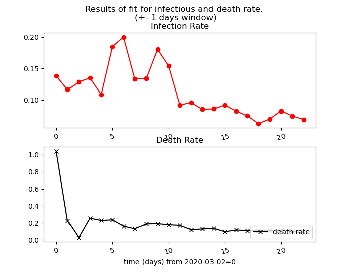
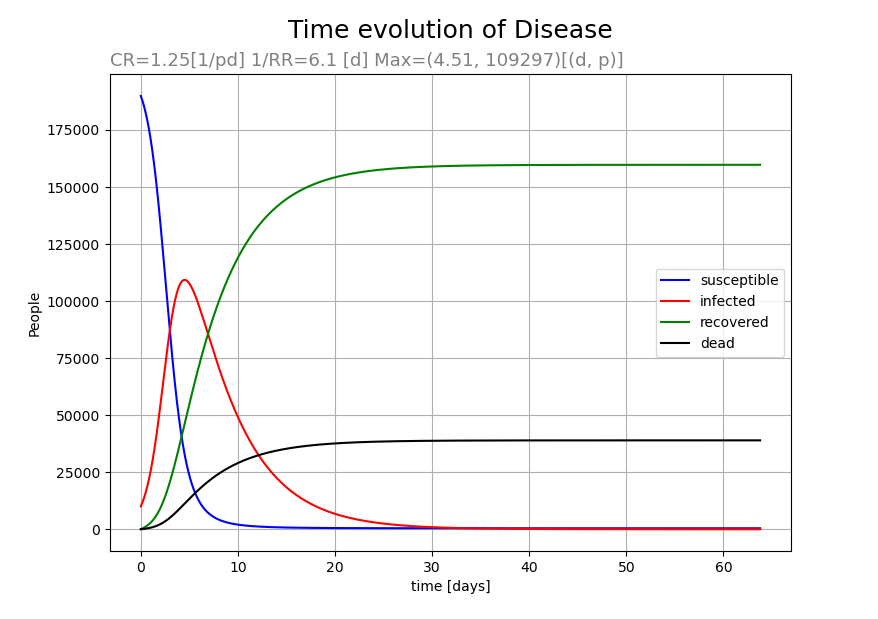
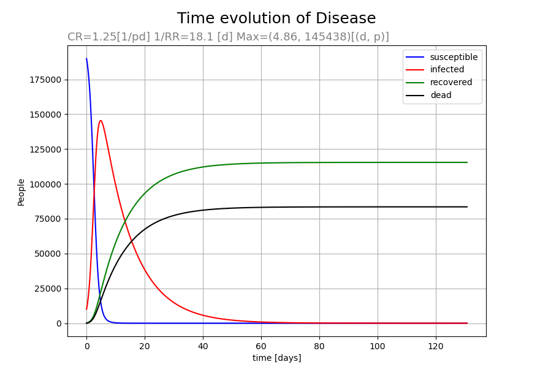
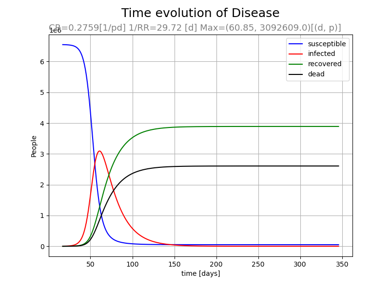

# disease Model
Model of infection based on SIR model, given by this EDO system:
	
	ds/dt = -CONT_RATE*s*i/N_population
	di/dt = (CONT_RATE*s*i/N_population) - (RECO_RATE*i) - (MORTALITY*i)
	dr/dt = RECO_RATE*i
	dd/dt = MORTALITY*i

Where `s` stands for _susceptibe_, `i` for _infected_, `r` for _recovered_ and `d` for _dead_. `CONT_RATE` or __contagious rate__ is the average number of contacts between people for a person per day times the probability of infection per contact (needs to be normalized to the total population). The __recovery rate__ (`RECO_RATE`) here is the inverse average time to overcome the disease and stop infecting others (in other words, the factor for the number of recoveries per day).

The model could also be extended to take into account different rates of recovery, contagious and to insert mortality or other relations.

# Requirements:

python `3.6` or newer, `matplotlib` and `numpy`

	pip3 install matplotlib
	pip3 install numpy
	
There is an optional module that requires the libraries `BeautifulSoup` and `selenium` and also [download the chromedriver](https://chromedriver.chromium.org/downloads); also, it requires to change the path of the driver in the class attribute `DataWebLoader.CHROMIUM_PATH` to its path in your computer. If you don't want to use this feature, skip these complementary installations.

# Parts:
## fitData.py
**fitData.py**  script has a time compilation from some online sources of _corona virus_ infected and deaths, for Italy and Spain. The module has a linear fitting function for base 10 logarithmic increase. The resultant constants are used to plot the perspectives for a certain day (counting from _2020-2-15_) and a plot of this linear trend for both countries.

__Arguments__:

~~~~~~~~~~~~~{.py}
    ## INPUTS
    
    date_min = datetime(2020, 3, 5)         # lower bound of data range
    date_max = datetime(2020, 3, 11)        # upper bound of data range
    date_prediction = datetime(2020, 3, 12) # prediction
~~~~~~~~~~~~~
    
The output depends on the date range:

	SPAIN   data from [2020-03-05] to [2020-03-11]
	-----------------------------------------
	Infect Rate:   0.1582   abscI:   0.2600
	Death  Rate:   0.2208   abscD:   0.0002
	Mortality:    0.0201 +/- 0.0052
        2020-03-12 : infected= 3374.0
        2020-03-12 : death= 110.0

	ITALY   data from [2020-03-05] to [2020-03-11]
	-----------------------------------------
	Infect Rate:   0.0882   abscI:  81.8895
	Death  Rate:   0.1273   abscD:   0.5487
	Mortality:    0.0471 +/- 0.0082
        2020-03-12 : infected= 16085.0
        2020-03-12 : death= 1120.0

The prediction depends on the date range selected, notice that my data for February and the beginning of March is not daily.In the other hand, governmental actions affects on the global trend of the progression, which is neither a simple exponential nor a geometric progression of a constant factor. This approximations are reliable for short term data collections (f.e, a week or 5 days) and a couple of days in the future. The approximation won't be valid when the active infections were near to the maximum.

The fit is got from a power of 10 and the interpretation for the slopes has to be compared from another slope for a time interval; it can be seen a reduction or increasing from different spread velocities. Lets have an infectious rate `A` and the same rate divided by a factor `r`. Then, for a `delta_days` interval (curve can shift any time to 0 if it's known the number of cases at that moment), the relation between the first rate `i` and the reduced one `i_r` is given by:

	i_r(delta_days) = i(delta_days)*10^(delta_days*A*(1-r)/r)
	i(t; A) = y(t_0)*10^(A*t)

For example, in Spain, the average over a window of 2 days gives a local rate of 0.135 for the __2020-03-11__ and of 0.068 for __2020-03-21__. That March 11th, the number of cases was 2277. `r=0.135/0.068=1.985`, so in case of continue with the rate, the infected would had been:`i(21th; A=0.135)=50975` (it was 25496). For the same period of time, lets drop to the second constant, so we expect:

	 i_r(21th; A=0.68) = 50975 * 10**(10*0.1351*(1-1.985)/1.985)= 50975*0.2136 = 10888 

(11075 if we do not round). As you see, we cannot naively assume estimations if these rates vary on time (It might needs a cumulative sum), but these rates gives an idea of its effect in the spread of the disease and the relation between two of them. The exact count  actually comes from a variation from the first rate and the second (in the mid way), which coincides with the activation of the cautionary actions of the government.

The fits can be run over all data making a local fit over a narrow window of days. In that case, we achieve a first approximation of the evolution of the rates, but its very sensitive to the window range and error is not given:

![alt text]
(https://github.com/migueldelafuente1/diseaseModel/blob/master/images/EvolutionOfRatesWindow1.png "Trends over the days with a window of one day")

 

![alt text]
(https://github.com/migueldelafuente1/diseaseModel/blob/master/images/EvolutionOfRatesWindow2.png "Trends over the days with a window of 2 day")

 

### worldometers scraper.

Refresh data manually is tedious, so there is a _scraper bot_ (`dataWebLoader`) that loads the web page for any available country in the web automatically. The values could also be saved and reloaded if you have download the data for that day.

The module requires `BeautifulSoup`, `selenium` and a `chromedriver`; also, it requires to change the path of the driver in the class attribute `DataWebLoader.CHROMIUM_PATH` to its path in your computer. If you don't want to use this feature, skip these complementary installations.

The usage is shown below, and then the prediction is made as before:

~~~~~~~~~~~~~{.py}
	from dataWebLoader import DataWebLoader
    
    countries = ['spain', 'italy', 'us']
    data = DataWebLoader.getData(countries, save=True)
    #data = DataWebLoader.loadJsonData() # (uncomment if data has been saved)
    
    for country, tables in data.items():
        processWebData(country, tables)
    
    ## Prediction:
    getRatesForDateRanges(date_min, date_max, date_prediction, graph=True)
~~~~~~~~~~~~~
  
## disease.py    
 **disease** module has the Disease Models. The models has the following parameters:

| Parameter | Default | Units | Description |
| --- | --- | --- | --- |
| t_step |  = 0.01 | days | Step for numeric method, optimize it with _optimizers.stepOptimizer_ tool. |
| days  |   = 200   | days |  |
| N_population | = 2e+5 | persons |  |
| contagious_rate | = 0.0 | 1/ day * persons | average number of contacts between people for a person per day times the probability of infection per contact |
| recovery_rate | = 0.0 | 1/ day | inverse average time to overcome the disease and stop infecting others |
| mortality | =0.0 |  | linear factor proportional to the infected |

These are some examples for a population of 2e+5 people, for a disease with a contagious rate of 1.25, a 4% mortality, and recovery rates (inverse) = 2.1, 6.1, 18.1 days. The images show also when the peak occurs and how many will be infected.

![alt text]
(https://github.com/migueldelafuente1/diseaseModel/blob/master/images/EvolutionOfRatesWindow2.png "1 over r eq 2 example")

 

![alt text]
(https://github.com/migueldelafuente1/diseaseModel/blob/master/images/EvolutionOfRatesWindow2.png "1 over r eq 6 example")

 

![alt text]
(https://github.com/migueldelafuente1/diseaseModel/blob/master/images/EvolutionOfRatesWindow2.png "1 over r eq 18 example")

 

## optimizers.py
**optimizers** has some functions to find the best parameters for the calculations.
### _stepOptimizer_ 
finds the step necessary for the Euler-Method iteration to be in a relative tolerance range when the time step is split.

This function iterates to find a value of the step for which the SIR simulation converges under a certain tolerance. The steps are divided by 2 in each iteration (for a maximum of h_max/2^-6).

| Argument | type | Description |
| --- | --- | --- |
| __h_max__ | double | first step value. in days|
| __tolerance__ | double |(=0.2 by default), tolerance ratio on step (1.0 for 100%).|
| __diseaseKwargs__ |Dictionary | The parameters for the DiseaseSimulation. |

### _modelOptimizerFromData_
From a set of data, find the best parameters (optimize time step in each iteration).

| Argument | type | Description |
| --- | --- | --- |
| h_max | double | Step In days, default = 0.01 |
| parameters0| <dict> | A first estimation of CONTAGIOUS_RATE, RECOVERY_RATE and MORTALITY |
| data | <list of tuples> | [(day, infected, recovered, dead)[0], ...]|
| h_tolerance | <double> default=0.1 | Tolerance ratio for the time step fitting |
| data_tolerance | <double> default=0.1 | Tolerance ratio for the model with the data |

Returns:
The most upgraded parameter sets and time step achieved.

The start point of time will be set as the first day of the data to simplify some of the adjustments. 
The process consists in:

1. Set up the first elements for t, infect, ... with the first data row.
2. Adapt the time step (stepOptimizer)
3. Calculate the difference between the data and the model(with time step optimized) in t_data time. For equations of 
	1. Death &rarr; M
	2. Recovered &rarr; RR
	3. f(RR, M ,N, Infected) &rarr; CR 
4. Calculate the step for each parameter as a difference data normalized by the minimum(difference), and get a new value form the median for all data. See function `optimicers.paramStep()`.
5. check an arbitrary value of tolerance, return the parameters and t_step if it's exceeded.

After then, the the evolution of the results is given as well as a run with graph for the best approximation.
__Example__
Given these values for Madrid, lets run the program:

| days (starting from 17=13-3-2020)| infected | recovered | dead |
| --- | --- | --- | --- |
|17 | 1990 | 1 (??) | 81 |
|20 | 4165 | 474 | 255 |
|23 | 6777 | 498 | 941 |
|26 | 9702 | 1899 | 1022 |

After 60 iterations, the parameters result:
	
	=================================================================
	   ***         DISEASE SIMULATION, SIR MODEL: INPUTS       ***
	   -----------------------------------------------------------
		   time step:       0.005    [days]
		   days:            200      [days]
		   N_population:    6550000  [persons]
		   
		   contagious rate: 0.2759 [1/ persons day]
		   recovery rate:   0.0336 [1/ days]
		   
		   Considering People Die: True 
		       Mortality: 2.2538 %
		   Considering [1] groups of recovery
	=================================================================

The value of the mortality went half underestimated if compared with the estimation in Spain (see below results of fitData.py for the same period), the value of contagious rate is quite overestimated (3.6 times the empirical value). The recovery rate (the inverse) fit quite well with the average value of recovery: oftenly 2 weeks, 3-6 week when complications. (`1/0.0336 = 29.8 days = 4.25 weeks`)
 
	SPAIN   data from [2020-03-17] to [2020-03-26]
	-----------------------------------------
	Infect Rate:   0.0759   abscI:  54.9212
	Death  Rate:   0.1075   abscD:   0.2393
	Mortality:    0.0568 +/- 0.0109
	        2020-03-28 : infected= 84633.0
	        2020-03-28 : death= 7833.0

The result for the model is:

![alt text]
(https://github.com/migueldelafuente1/diseaseModel/blob/master/images/ResultOptimizationMadrid.png "(Unreliable) Evolution of Covid in Madrid")

 

As we can see, if we use 4 static (and independent) parameters, the prediction is quite apocalyptic and not reliable. In reality, these parameters depends on the system and vary with the time, specially the contagious rate, which is dependent on the number of contacts (drastically reduced with the generalized quarantine).
